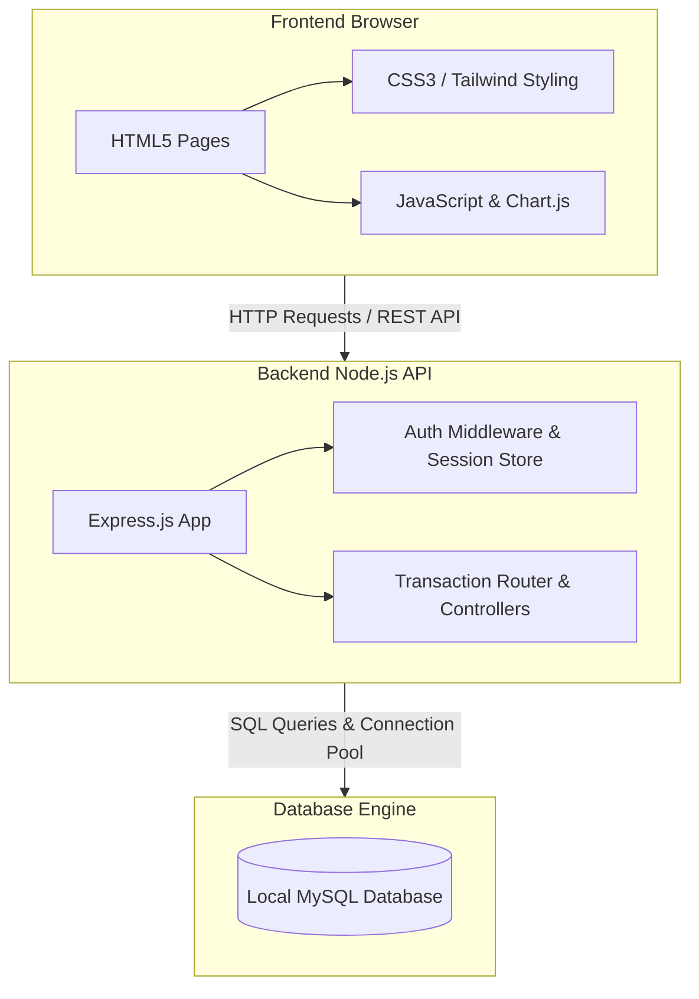

# 🚀 Startup Funding & Investor Tracking System (SFITS)

A full-stack web application designed to track startup fundraising, investor investments, founder equity, cap tables, and dilution history in one place.

<<<<<<< HEAD
This project was built as a Database Management Systems (DBMS) course project. It shows how relational database design, normalization, transactions, and triggers work in a real-world application.
=======
> **Disclaimer:** SFITS is designed to record investments that have already been finalized outside the platform. It acts as a system of record and does not facilitate live monetary transfers, legal negotiations, or fund transfers.
>>>>>>> cab629c8b103e4e379aaf4e1c97845148ad86188

---

## 📌 Problem Statement
Early-stage startups often struggle to keep track of founder equity, funding rounds, and how new investments dilute existing ownership. At the same time, investors need a simple way to look at startup profiles, track active funding rounds, and monitor their investment portfolios. 

SFITS solves these problems by providing a clean database system where founders and investors can log and view clean, automated equity calculations.

---

<<<<<<< HEAD
## 🎯 Project Objectives
*   Centralize and organize startup funding information.
*   Automate cap table and equity dilution calculations.
*   Maintain a clear, historic ledger of who owns what after each round.
*   Allow founders to manage their team's equity and active funding rounds.
*   Allow investors to browse startups, log investments, and view their portfolios.
=======
## 👥 User Roles
| Role | Responsibilities |
| :--- | :--- |
| **Founder** | Registers a startup, manages co-founders, creates funding rounds, and tracks company equity. |
| **Investor** | Browses startups, logs investments into funding rounds, and monitors their investment portfolio. |

---

## 🔄 Startup Investment Workflow
1. **Founder Registration:** Founders sign up and register their startups.
2. **Founder Setup:** Founders add co-founders and specify initial equity splits.
3. **Round Creation:** Founders create a new funding round (e.g., Seed or Series A).
4. **Investor Discovery:** Investors browse available startups and their active funding rounds.
5. **Investment Entry:** Investors log an investment amount and the equity acquired.
6. **Automatic Dilution:** The database processes the investment, automatically diluting everyone's equity and logging the changes.
7. **Cap Table Review:** Both founders and investors view the updated cap table showing new ownership distributions.
>>>>>>> cab629c8b103e4e379aaf4e1c97845148ad86188

---

## 👥 User Roles
| Role | Responsibilities |
| :--- | :--- |
| **Founder** | Registers a startup, manages co-founders, creates funding rounds, and tracks company equity. |
| **Investor** | Browses startups, logs investments into funding rounds, and monitors their investment portfolio. |

---

## 🔄 Startup Investment Workflow
1. **Founder Registration:** Founders sign up and register their startups.
2. **Founder Setup:** Founders add co-founders and specify initial equity splits.
3. **Round Creation:** Founders create a new funding round (e.g., Seed or Series A).
4. **Investor Discovery:** Investors browse available startups and their active funding rounds.
5. **Investment Entry:** Investors log an investment amount and the equity acquired.
6. **Automatic Dilution:** The database processes the investment, automatically diluting everyone's equity and logging the changes.
7. **Cap Table Review:** Both founders and investors view the updated cap table showing new ownership distributions.

---

## 🏗️ System Architecture
User  
 ↓  
Frontend (HTML, CSS, JavaScript)  
 ↓  
Node.js + Express Backend  
 ↓  
Local MySQL Database  

---

## 📊 Major Entities
Here are the main tables in the database:

| Entity | Description |
| :--- | :--- |
| **USERS** | Stores user credentials (email, hashed password) and roles (founder/investor). |
| **STARTUP** | Contains startup company details, location, and industry classification. |
| **FOUNDER** | Keeps track of founding members, roles, and their initial equity values. |
| **INVESTOR** | Stores investor firm details, country, and visibility state. |
| **INDUSTRY** | Holds list of industries (e.g., FinTech, SaaS, HealthTech). |
| **FUNDING_ROUND** | Tracks individual funding stages, valuation, and total amount raised. |
| **INVESTOR_FOCUS_INDUSTRY** | Many-to-many link table mapping investors to their industries of interest. |
| **INVESTMENT** | Stores specific investment transactions (amounts invested and equity acquired). |
| **EQUITY_HISTORY** | Ledger table storing historic and current equity stakes. |
| **EQUITY_HISTORY_AUDIT** | Log table created automatically by database triggers for audits. |

---

## 📈 Database Statistics
Based on the project's seed data, the database starts with:
*   **8 Users**
*   **12 Industries**
*   **8 Startups**
*   **10 Founders**
*   **6 Investors**
*   **15 Funding Rounds**
*   **16 Investments**
*   **51 Equity History Records**

---

## 🗺️ Entity Relationship (ER) Diagram
Your ER diagram is **fully correct** and represents the database structure accurately. It correctly displays:
*   Headquarters as a composite attribute (City, State, Country).
*   Derived attributes (like Startup_age).
*   Weak entities (`Equity_History` and `Investment`).
*   Many-to-many relationships (like Investors to Focus Industries).

To display your ER diagram here, save your diagram image (e.g., `ER_diagram.png`) in the root folder of this project and uncomment the line below:
<!--  -->

---

## 🧠 DBMS Concepts Implemented

*   **Relational Design & Constraints:** Uses Primary Keys, Foreign Keys, `NOT NULL` fields, and `UNIQUE` keys (e.g., to prevent duplicate investor logs for the same round).
*   **Check Constraints:** Enforces checks (like making sure equity percentages stay between `0` and `100`).
*   **Database Triggers:** Implements `after_equity_insert` and `after_equity_update` triggers to log updates to the `EQUITY_HISTORY_AUDIT` table automatically.
*   **Transactions (ACID):** Uses database transactions (`db.beginTransaction()`) when logging investments to ensure that equity dilution updates and transaction logs happen together or fail together.
*   **Indexes:** Speeds up queries using indexes on foreign keys (`idx_founder_startup`, `idx_funding_round_startup`, etc.).

---


## ⚙️ System Architecture



---
## 📂 Repository Structure
```
SFITS_DBMS/
├── Backend/
│   ├── scripts/
│   │   └── tmp_debug_equity.js  # Script to test dilution math
│   ├── .env.example             # Example environment file
│   └── server.js                # Express server and database routes
├── Database/
│   ├── schema.sql               # Database tables, triggers, and indices
│   └── seed.sql                 # Initial seed data for testing
├── Frontend/
│   ├── pages/                   # Pages for founder activities
│   │   ├── captable.html        # Dynamic Cap Table rendering
│   │   ├── founders.html        # Manage founder equity splits
│   │   ├── funding.html         # Add funding rounds
│   │   ├── history.html         # Dilution history page
│   │   ├── investors.html       # View list of investors
│   │   └── startups.html        # Manage startup details
│   ├── investor_pages/          # Pages for investor activities
│   │   ├── browse_startups.html # Browse startups
│   │   ├── invest.html          # Log an investment
│   │   └── my_investments.html  # View personal portfolio
│   ├── dashboard.html           # Simple dashboard entry
│   ├── founder_dashboard.html   # Founder portal interface
│   ├── investor_dashboard.html  # Investor portal interface
│   ├── login.html               # Sign In page
│   ├── signup.html              # Sign Up page
│   ├── styles.css               # Page styles
│   ├── theme.js                 # Theme toggler (light/dark mode)
│   └── welcome.html             # Landing page
├── package.json                 # Setup scripts and dependencies
├── package-lock.json
└── .gitignore
```

---

## 🛠 Technology Stack
*   **Frontend:** HTML5, CSS3, JavaScript, Chart.js (for equity pie-charts).
*   **Backend:** Node.js, Express.js.
*   **Database:** Local MySQL.
*   **Security:** `bcrypt` (password hashing), `crypto` (session tokens).

---

## ⚙️ Local Setup

### 1. Clone the Project
```bash
git clone https://github.com/karvevaishnavi16/SFITS_DBMS.git
cd SFITS_DBMS
```

### 2. Install Dependencies
Run this in the root directory to install backend and server packages:
```bash
npm install
```

### 3. Setup MySQL Database
1.  Open your MySQL terminal or Workbench.
2.  Create a database:
    ```sql
    CREATE DATABASE SFITS_DBMS_PRJ;
    ```
3.  Import the database structure:
    ```bash
    mysql -u your_username -p SFITS_DBMS_PRJ < Database/schema.sql
    ```
4.  Load the seed data:
    ```bash
    mysql -u your_username -p SFITS_DBMS_PRJ < Database/seed.sql
    ```

### 4. Setup Environment File
1.  Go to the `Backend` directory.
2.  Copy `.env.example` to a new file named `.env`:
    ```bash
    cp .env.example .env
    ```
3.  Update the `.env` file with your local MySQL password and database name:
    ```env
    DB_HOST=localhost
    DB_USER=root
    DB_PASSWORD=your_mysql_password
    DB_NAME=SFITS_DBMS_PRJ
    ```

### 5. Run the Project
Go back to the root directory and start the servers:
```bash
npm run dev
```
This runs both the backend and frontend simultaneously. Open your browser to `http://localhost:3000` to view the welcome page.

---

## 👥 Demo Accounts
You can log in with any of these pre-seeded accounts using the password `pass123`:

*   **Founder:** `aarav@paynest.com`
*   **Founder:** `kunal@vestly.com`
*   **Investor:** `rohan@northstar.com`
*   **Investor:** `ananya@bluewave.com`

---

## ⚠️ Challenges Faced
*   Handling complex relational math to calculate equity dilution across multiple stakeholders.
*   Ensuring database transactions complete cleanly so that no partial history records are saved on error.
*   Writing triggers that automatically log adjustments to audit tables without slowing down queries.

---

## 🔮 Future Enhancements
*   Adding JWT token auth for cleaner session management.
*   Adding password reset features and email verification.
*   Adding data exporting features (downloading Cap Tables as PDF/CSV).
*   Integrating in-app alerts when investments are finalized.

---

## 🎓 Academic Information
*   **Course:** Database Management Systems (DBMS)
*   **Project Type:** Semester Project
*   **Academic Year:** 2025–26
*   **Student:** Vaishnavi Karve
*   **License:** Fictional academic project developed for educational purposes.
