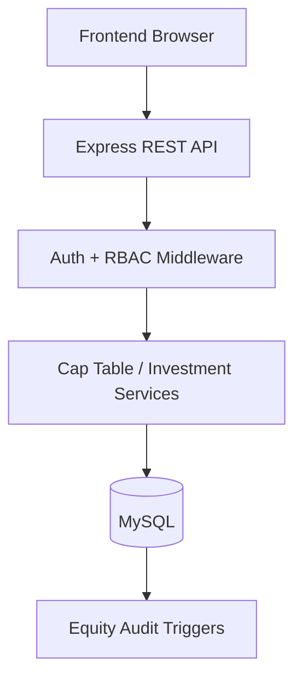

# SFITS — Startup Funding Intelligence & Tracking System

SFITS is a full-stack, database-driven platform for founders and investors to record startup funding rounds, investments, ownership changes and cap-table history.

The project is intentionally a **system of record**: it records finalized investment information and does not process money transfers, negotiate deals or provide legal/financial advice.

## Why this project

Startup ownership becomes difficult to track once multiple funding rounds and investors are involved. SFITS keeps the funding lifecycle in one place:

```text
Startup
  ↓
Founders + Initial Ownership
  ↓
Funding Round
  ↓
Investment
  ↓
Transaction-safe Dilution
  ↓
New Cap-Table Snapshot
  ↓
Audit History + Portfolio Analytics
```

## Core capabilities

### Founder workflow
- Register and manage startups.
- Add co-founders and initial ownership.
- Create Pre-Seed through Series C funding rounds.
- Track funding progress, valuation and investor participation.
- Inspect current and historical cap tables.

### Investor workflow
- Maintain an investor profile.
- Browse startups and funding information.
- Record finalized investments.
- Automatically update ownership after an investment.
- View portfolio holdings and investment summaries.
- Discover investors relevant to a startup using industry and country fit.

### Database integrity
- Relational MySQL schema with foreign keys and unique constraints.
- Funding and investment data are kept consistent with canonical schema fields.
- Every investment writes a complete ownership snapshot.
- Cap-table totals are validated to remain 100%.
- Equity changes are captured by database audit triggers.
- Investment + funding + cap-table changes are committed as one transaction.

## Engineering highlights

- **Node.js + Express REST API**
- **MySQL connection pooling** instead of a single global connection
- **Persistent database-backed authentication sessions** with hashed session tokens and expiry
- **Role-based authorization** for founder/investor actions
- Ownership is derived from the authenticated user instead of trusting a client-supplied `user_id`
- Parameterized SQL queries
- Centralized API error handling without exposing SQL error messages
- Input validation for authentication, funding and investment operations
- Tested cap-table dilution logic using Node's built-in test runner
- GitHub Actions CI runs the automated test suite on pushes and pull requests
- Search/filter/pagination support for startup discovery

## Database model

| Entity | Purpose |
| --- | --- |
| `USERS` | Login identity, credentials and role |
| `INDUSTRY` | Startup sectors and investor interests |
| `STARTUP` | Startup profile and owner |
| `FOUNDER` | Founder profiles and initial ownership |
| `INVESTOR` | Investor/firm profiles |
| `INVESTOR_FOCUS_INDUSTRY` | Many-to-many investor industry preferences |
| `FUNDING_ROUND` | Funding stage, target, amount raised and valuation |
| `INVESTMENT` | Finalized investor participation in a round |
| `EQUITY_HISTORY` | Immutable-style ownership snapshots over time |
| `EQUITY_HISTORY_AUDIT` | Trigger-based equity change audit trail |
| `AUTH_SESSION` | Persistent server-side login sessions |

## Cap-table calculation

For an investment acquiring `x%` post-money ownership, each existing holder is diluted by:

```text
new_existing_ownership = old_ownership × (100 - x) / 100
```

The new investor receives `x%`. The service validates that the resulting snapshot still totals 100% before it is written to MySQL.

The calculation is implemented independently in `Backend/services/capTable.js` and covered by automated tests, making the core financial logic easier to reason about and maintain.

## DBMS concepts demonstrated

### Normalization
The schema separates users, startups, founders, investors, industries, funding rounds and investments to reduce duplication and update anomalies.

### Constraints
Foreign keys, unique constraints and `CHECK` constraints protect important relationships and numeric ranges.

### Transactions / ACID
An investment is treated as one logical unit of work. If any part of the investment, funding update or cap-table snapshot fails, the transaction is rolled back.

### Triggers and audit logging
Insert, update and delete operations on `EQUITY_HISTORY` are recorded in `EQUITY_HISTORY_AUDIT`.

### Indexing
Frequently filtered/joined columns have indexes for startup ownership, funding rounds, investments and equity-history lookups.

## Architecture



## Repository structure

```text
SFITS/
├── Backend/
│   ├── services/
│   │   └── capTable.js
│   ├── tests/
│   │   └── capTable.test.js
│   ├── .env.example
│   └── server.js
├── Database/
│   ├── migrations/
│   │   └── 002_production_hardening.sql
│   ├── schema.sql
│   └── seed.sql
├── Frontend/
│   ├── pages/
│   ├── investor_pages/
│   ├── founder_dashboard.html
│   ├── investor_dashboard.html
│   ├── login.html
│   ├── signup.html
│   ├── styles.css
│   └── theme.js
├── .github/workflows/
│   └── ci.yml
├── package.json
└── README.md
```

## Tech stack

- **Frontend:** HTML5, CSS3, Vanilla JavaScript, Tailwind CDN, Chart.js
- **Backend:** Node.js, Express.js, MySQL2
- **Database:** MySQL
- **Authentication:** bcrypt + persistent database-backed sessions
- **Testing:** Node.js built-in test runner
- **CI:** GitHub Actions

## Setup

### 1. Install dependencies

```bash
npm install
```

### 2. Create the database

For a fresh database, run:

```bash
mysql -u your_username -p < Database/schema.sql
mysql -u your_username -p SFITS_DBMS_PRJ < Database/seed.sql
```

If you already have an older SFITS database, run the migration instead of recreating the database:

```bash
mysql -u your_username -p SFITS_DBMS_PRJ < Database/migrations/002_production_hardening.sql
```

### 3. Configure the backend

Copy `Backend/.env.example` to `Backend/.env` and configure your local MySQL credentials.

```env
DB_HOST=localhost
DB_USER=root
DB_PASSWORD=your_mysql_password
DB_NAME=SFITS_DBMS_PRJ
PORT=5000
FRONTEND_ORIGIN=http://localhost:3000
SESSION_DAYS=7
DB_POOL_SIZE=10
```

Never commit `.env` or real credentials.

### 4. Run

```bash
npm run dev
```

- Backend: `http://localhost:5000`
- Frontend: `http://localhost:3000`

### 5. Run tests

```bash
npm test
```

The test suite covers dilution of existing holders, repeat investment by an existing investor, invalid cap-table totals and invalid equity inputs.

## Demo data

The repository contains fictional seed data for local development. The seeded password is intentionally simple for demo use only and must not be reused in production.

## API highlights

```text
POST   /signup
POST   /login
POST   /logout

POST   /addStartup
POST   /addFounder
POST   /addFunding
POST   /addInvestment

GET    /allStartups
GET    /allRounds
GET    /investors
GET    /history/:startup_id
GET    /capTable/:startup_id
GET    /capTableAtDate/:startup_id
GET    /investorMatches/:startup_id
GET    /startupDashboard/:startup_id
```

## Product direction

The next useful product extensions are:

- Pro-rata participation calculations for future rounds
- Exportable cap-table and investment reports
- Investor stage/cheque-size preferences for richer matching
- Notifications for upcoming funding rounds
- More portfolio analytics and valuation history

SFITS is intended to demonstrate both **DBMS fundamentals and practical full-stack engineering**, with correctness of financial/ownership data treated as the central design requirement.
