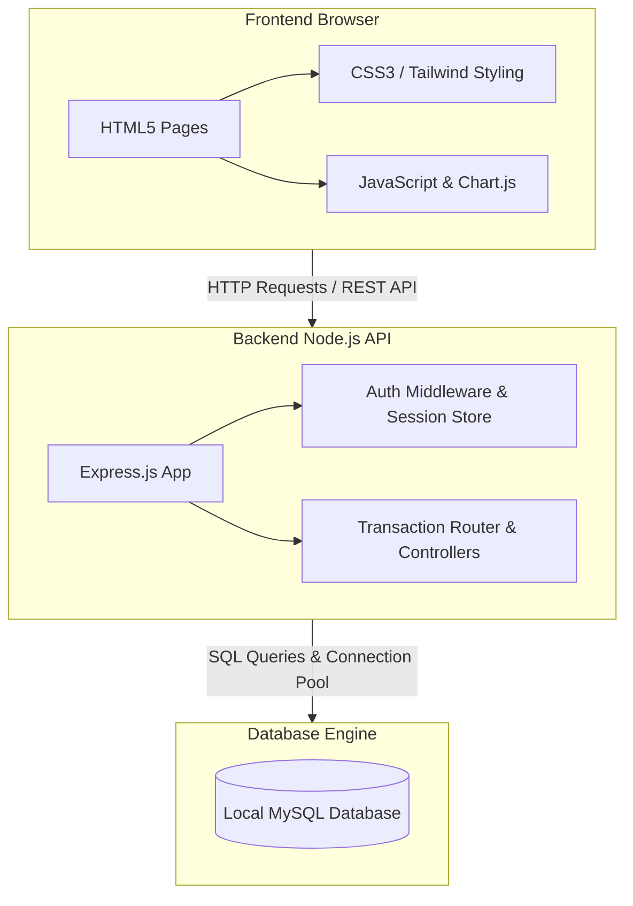

# 🚀 Startup Funding & Investor Tracking System (SFITS)

SFITS is a web application that helps founders and investors keep track of startup funding rounds, investments, and equity dilution. Whenever a startup raises money, the database automatically recalculates who owns what percentage of the company so you don't have to do the math manually.

> **Disclaimer:** SFITS is designed to record investments that have already been finalized outside the platform. It acts as a system of record and does not facilitate live monetary transfers, legal negotiations, or fund transfers.

---

## 📌 Problem Statement

In the early stages of a startup, tracking ownership can get messy. When co-founders start a company, they split the equity (e.g., 50/50). However, as they raise new funding rounds (Seed, Series A, etc.) and bring in investors, everyone's ownership gets "diluted" (shrunk). 

Tracking these changes across multiple rounds and investors on manual spreadsheets often leads to calculation errors and lost records. SFITS solves this by providing a single database-driven platform where:
*   Founders can easily manage their startup profiles, add co-founders, and log new funding rounds.
*   Investors can browse startups, log their investment deals, and monitor their portfolios.
*   The database automatically computes the diluted equity split and keeps a historic ledger of every change.

---

## 👥 User Roles
| Role | Responsibilities |
| :--- | :--- |
| **Founder** | Registers a startup, manages co-founders, creates funding rounds, and tracks company equity. |
| **Investor** | Browses startups, logs investments into funding rounds, and monitors their investment portfolio. |

---

## 🔄 Startup Investment Workflow
1. **Founder Registration:** Founders sign up and register their startups.
2. **Founder Setup:** Founders add co-founders and specify initial equity splits.
3. **Round Creation:** Founders create a new funding round (e.g., Seed or Series A).
4. **Investor Discovery:** Investors browse available startups and their active funding rounds.
5. **Investment Entry:** Investors log an investment amount and the equity acquired.
6. **Automatic Dilution:** The database processes the investment, automatically diluting everyone's equity and logging the changes.
7. **Cap Table Review:** Both founders and investors view the updated cap table showing new ownership distributions.

---

## 🗃 Major Database Entities

These are the main tables in the database schema:

| Table Name | Description | Key Columns |
| :--- | :--- | :--- |
| **`USERS`** | Holds login credentials and roles. | `user_id`, `username`, `email`, `password` (bcrypt-hashed), `role` (`founder`/`investor`) |
| **`INDUSTRY`** | List of business sectors for startups and investor interests. | `industry_id`, `industry_name` (e.g., FinTech, SaaS) |
| **`STARTUP`** | Startups created by founders, including their stage and location. | `startup_id`, `startup_name`, `stage`, `founded_year`, `user_id` |
| **`FOUNDER`** | Details of startup co-founders and their initial equity stakes. | `founder_id`, `founder_name`, `founder_role`, `initial_equity`, `startup_id` |
| **`INVESTOR`** | Profiles of registered investors and investment firms. | `investor_id`, `investor_name`, `firm_name`, `investor_type` (e.g., VC, Angel) |
| **`INVESTOR_FOCUS_INDUSTRY`** | Maps which industry sectors an investor is interested in. | `investor_id`, `industry_id` |
| **`FUNDING_ROUND`** | Funding rounds raised by startups. | `round_id`, `round_type`, `round_date`, `valuation`, `total_amount_raised` |
| **`INVESTMENT`** | Logs which investor put money into which round. | `investment_id`, `investor_id`, `round_id`, `amount_invested`, `equity_acquired` |
| **`EQUITY_HISTORY`** | The ledger tracking who owns what percentage after each round. | `ownership_id`, `startup_id`, `round_id`, `founder_id`/`investor_id`, `equity_percentage` |
| **`EQUITY_HISTORY_AUDIT`** | Audit log tracking changes made to the equity history table. | `audit_id`, `ownership_id`, `old_equity_percentage`, `new_equity_percentage`, `action_type` |

---

## 📊 Database Statistics (Seed Data)

The system comes pre-seeded with realistic test data containing:
*   **8 Users** (Passwords are all set to `pass123`)
*   **12 Industries**
*   **8 Startups**
*   **10 Founders**
*   **6 Investors**
*   **15 Funding Rounds**
*   **16 Investment Records**
*   **51 Equity History Records**

---

## 🛠 Implemented DBMS Concepts

This project showcases the practical application of core database principles:

### 1. Database Normalization
The database is designed up to **3rd Normal Form (3NF)**. This keeps the tables organized, reduces repeated data, and prevents anomalies (errors when inserting, updating, or deleting records).

### 2. Constraints & Rules
*   **Check Constraints (`CHECK`):** Ensures equity percentages are valid (greater than 0 and less than or equal to 100). It also prevents a single history row from representing both a founder and an investor at the same time.
*   **Foreign Keys:** Maintains relationships between tables (e.g., deleting a startup or investor handles cleanups correctly through constraints like `ON DELETE CASCADE`).
*   **Unique Constraints:** Prevents duplicate entries, like registering the same email twice, or logging the same investor multiple times in the same round.

### 3. Database Triggers
We use MySQL triggers (`after_equity_insert` and `after_equity_update`) to automatically log any additions or updates on the `EQUITY_HISTORY` table into the `EQUITY_HISTORY_AUDIT` table. This creates a secure, hands-off audit trail.

### 4. Transactions (ACID)
Adding a new investment requires updating multiple tables. We use SQL transactions (`db.beginTransaction()`, `db.commit()`, and `db.rollback()`) to make sure that if any query fails (e.g., during dilution math updates), all database changes are rolled back. This keeps your cap table math clean and correct.

---


## ⚙️ System Architecture



---
## 📂 Repository Structure

```
SFITS_DBMS/
├── Backend/
│   ├── scripts/
│   │   └── tmp_debug_equity.js  # Script to test and debug dilution calculations
│   ├── .env.example             # Template for database configuration environment variables
│   └── server.js                # Express server handling REST API routes and SQL queries
├── Database/
│   ├── schema.sql               # Database structure (Tables, constraints, triggers)
│   └── seed.sql                 # Fictional seed data
├── Frontend/
│   ├── pages/                   # Founder interfaces (startups, co-founders, funding rounds)
│   │   ├── captable.html        # Real-time cap table visualization
│   │   ├── founders.html        # Add co-founders
│   │   ├── funding.html         # Start a funding round
│   │   ├── history.html         # View historic equity logs
│   │   ├── investors.html       # View list of investors
│   │   └── startups.html        # Create and manage startups
│   ├── investor_pages/          # Investor interfaces
│   │   ├── browse_startups.html # Search registered startups
│   │   ├── invest.html          # Log an investment
│   │   └── my_investments.html  # Track total portfolio value and holdings
│   ├── dashboard.html           # Simple dashboard landing portal
│   ├── founder_dashboard.html   # Main dashboard for founders
│   ├── investor_dashboard.html  # Main dashboard for investors
│   ├── login.html               # Authentication page
│   ├── signup.html              # Registration page
│   ├── styles.css               # Styling sheet
│   ├── theme.js                 # Theme controller (Dark / Light mode toggle)
│   └── welcome.html             # Homepage
├── package.json                 # Node.js project packages and run scripts
├── package-lock.json
└── .gitignore
```

---

## 🛠 Tech Stack

*   **Frontend:** HTML5, CSS3, Vanilla JavaScript, Chart.js (for rendering cap table charts).
*   **Backend:** Node.js, Express.js.
*   **Database:** MySQL.
*   **Security:** `bcrypt` (password hashing), `crypto` (session token generation), `cors`, `dotenv`.

---

## ⚙️ Setup & Installation

Here is how you can run the project locally on your machine:

### 1. Clone the Repository
```bash
git clone https://github.com/karvevaishnavi16/SFITS_DBMS.git
cd SFITS_DBMS
```

### 2. Install Dependencies
Run this in the root directory to install required packages:
```bash
npm install
```

### 3. Setup Your Database
1.  Make sure you have a local **MySQL Server** installed and running.
2.  Open your MySQL terminal or Workbench and create the database:
    ```sql
    CREATE DATABASE SFITS_DBMS_PRJ;
    ```
3.  Run the schema setup:
    ```bash
    mysql -u your_username -p SFITS_DBMS_PRJ < Database/schema.sql
    ```
4.  Load the seed data:
    ```bash
    mysql -u your_username -p SFITS_DBMS_PRJ < Database/seed.sql
    ```

### 4. Configure Environment Variables
1.  Go into the `Backend/` directory.
2.  Duplicate `.env.example` and name the new file `.env`:
    ```bash
    cp .env.example .env
    ```
3.  Open `.env` and fill in your database credentials:
    ```env
    DB_HOST=localhost
    DB_USER=your_mysql_username
    DB_PASSWORD=your_mysql_password
    DB_NAME=SFITS_DBMS_PRJ
    ```

### 5. Run the Application
Go back to the root directory and run:
```bash
npm run dev
```
*   This uses `concurrently` to start the backend server (on port `5000`) and the frontend web server (on port `3000`) at the same time.
*   Your default browser will automatically open to `http://localhost:3000`.

---

## 👥 Demo Accounts

You can test the system using these pre-seeded accounts. All accounts use the password **`pass123`**:

| Role | Name | Email | Password |
| :--- | :--- | :--- | :--- |
| **Founder** | Aarav Sharma | `aarav@paynest.com` | `pass123` |
| **Founder** | Kunal Verma | `kunal@vestly.com` | `pass123` |
| **Founder** | Sneha Rao | `sneha@northloop.com` | `pass123` |
| **Founder** | Pooja Iyer | `pooja@ledgerly.com` | `pass123` |
| **Investor** | Rohan Malhotra | `rohan@northstar.com` | `pass123` |
| **Investor** | Ananya Kapoor | `ananya@bluewave.com` | `pass123` |
| **Investor** | Priya Nair | `priya@solo.com` | `pass123` |

---

## 🔮 Future Enhancements

*   **JWT Authentication:** Replace the basic session cache with JSON Web Tokens (JWT) for secure authentication.
*   **Pro-rata Calculations:** Let investors calculate the amount they need to invest in future rounds to keep their exact ownership percentage.
*   **Milestone Logging:** Track target funding releases based on startup roadmap checkpoints.
*   **Data Exporters:** Export cap tables and history tables as PDF or CSV files.
