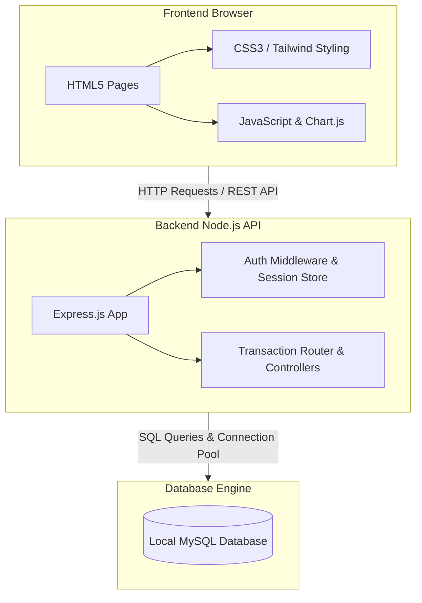

# 🚀 Startup Funding & Investor Tracking System (SFITS)

A full-stack, database-driven web application developed to streamline startup fundraising, investor participation, founder equity management, cap table tracking, and investment monitoring. Designed as part of a Database Management Systems (DBMS) course, this system serves as an automated ledger to track cap table dilution and ownership history across multiple rounds of funding.

> [!NOTE]
> **Disclaimer:** SFITS is designed to record investments that have already been finalized outside the platform. It acts as a system of record and does not facilitate live monetary transfers, legal negotiations, or fund transfers.

---

## 📖 Table of Contents
1. [What It Does](#-what-it-does)
2. [Database Statistics](#-database-statistics)
3. [System Architecture](#-system-architecture)
4. [Implemented DBMS Concepts](#-implemented-dbms-concepts)
5. [Repository Structure](#-repository-structure)
6. [Tech Stack](#-tech-stack)
7. [Setup & Installation](#-setup--installation)
8. [Demo Accounts](#-demo-accounts)
9. [Future Enhancements](#-future-enhancements)

---

## 🚀 What It Does

SFITS implements a role-based environment catering to the two primary actors of the startup ecosystem:

### 👥 User Roles & Dashboards

*   **Founder Dashboard:** 
    *   **Startup Registry:** Register startups, define stages (Pre-Seed to Series C), and manage locations.
    *   **Founder/Co-Founder Equity:** Assign initial equity stakes to founders (validating that total initial equity does not exceed 100%).
    *   **Funding Round Manager:** Log funding rounds (Seed, Series A, Series B, etc.) and calculate target valuations.
    *   **Real-time Cap Table:** Automatically compute and display equity ownership percentages of all founders and investors after dilution.
    *   **Equity History Ledger:** Track historical logs of ownership changes from the initial stage through all rounds.
*   **Investor Dashboard:**
    *   **Directory & Search:** Browse registered startups and analyze their funding status, stages, and focus industries.
    *   **Investment Logging Portal:** Log investment amounts, acquire equity stakes, and reference deal IDs.
    *   **Portfolio Tracker:** Track the performance, total capital deployed, and equity owned across multiple startups.

---

## 📊 Database Statistics

The default production/development database is populated with realistic, fictional seed data tracking:
*   **8 Users** (with secure bcrypt-hashed credentials)
*   **12 Industry Classifications** (FinTech, HealthTech, EdTech, E-Commerce, etc.)
*   **8 Startups** (PayNest, Vestly, Northloop Health, CropSense, Ledgerly, Skillbridge, Quickcart Logistics, Homestead Robotics)
*   **10 Founders** with structured roles (CEOs, CTOs, Founders)
*   **6 Investors** (VCs, Angels, Private Equity firm representatives)
*   **15 Funding Rounds** (from initial baseline rounds to Series C rounds)
*   **16 Investment Records** (detailing exact amounts deployed and equity acquired)
*   **51 Equity History Records** (forming a full timeline of capitalization changes)

---

## ⚙️ System Architecture



---

## 🗃 Implemented DBMS Concepts

This project showcases the implementation of core DBMS concepts directly within MySQL:

### 1. Relational Database Design & Normalization
The database schema has been normalized up to **3rd Normal Form (3NF)** to eliminate redundancy and update anomalies:
*   Transitive dependencies have been removed by splitting industries and startup profiles into separate tables.
*   Strong referential integrity is established across all tables.

### 2. Constraints & Referential Integrity
*   **Primary & Foreign Keys:** Enforced on every table to guarantee entity integrity.
*   **Check Constraints (`CHECK`):**
    *   `chk_initial_equity` (on `FOUNDER`): Equity must be between `0` and `100`.
    *   `chk_equity_acquired` (on `INVESTMENT`): Acquired equity must be between `0` and `100`.
    *   `chk_equity_percentage` (on `EQUITY_HISTORY`): Current stake must be between `0` and `100`.
    *   `chk_stakeholder_type` (on `EQUITY_HISTORY`): Ensures a record belongs to *either* a founder or an investor, but never both.
*   **Unique Constraints:**
    *   `unique_investor_round` (on `INVESTMENT`): Prevents duplicate entries for the same investor participating in the same funding round.
    *   `email` unique on `USERS` to avoid double registrations.
    *   `startup_name` unique on `STARTUP` to prevent name collision.

### 3. Advanced SQL & Database Programming
*   **Database Triggers:**
    *   `after_equity_insert`: Automatically logs entries into `EQUITY_HISTORY_AUDIT` with an `INSERT` action tag when new ownership rows are recorded.
    *   `after_equity_update`: Automatically logs updates into `EQUITY_HISTORY_AUDIT` with `UPDATE` action tag, capturing both `old_equity_percentage` and `new_equity_percentage`.
*   **Transactional Integrity (ACID):**
    *   Adding an investment triggers an atomic transaction utilizing `db.beginTransaction()`, `db.commit()`, and `db.rollback()`.
    *   When an investor adds an investment, the backend automatically dilutes existing shareholders' equity (multiplying previous percentages by `(100 - new_equity) / 100`) and inserts the new records into `EQUITY_HISTORY`. If any insert fails, the transaction is rolled back completely to prevent incomplete or corrupt cap tables.
*   **Indexes:**
    *   Defined explicitly to optimize lookups on foreign keys (e.g., `idx_founder_startup`, `idx_funding_round_startup`, `idx_equity_history_round`).
*   **Analytical Queries & Joins:**
    *   Utilizes advanced analytical functions like window queries (`ROW_NUMBER() OVER (PARTITION BY ... ORDER BY recorded_at DESC)`) in Node.js to fetch the latest equity stakes for dynamic dilution calculations.

---

## 📂 Repository Structure

```
SFITS_DBMS/
├── Backend/
│   ├── scripts/
│   │   └── tmp_debug_equity.js  # Utility script for verifying dilution maths
│   ├── .env.example             # Template for local environment variables
│   └── server.js                # Express REST API, auth middleware, and DB router
├── Database/
│   ├── schema.sql               # Database schema: tables, constraints, indexes & triggers
│   └── seed.sql                 # Fictional seed data (users, startups, deals, history)
├── Frontend/
│   ├── pages/                   # Founder-specific management pages
│   │   ├── captable.html        # Dynamic Cap Table rendering (Chart.js)
│   │   ├── founders.html        # Manage founders and initial equity splits
│   │   ├── funding.html         # Launch/log funding rounds
│   │   ├── history.html         # View full historic audit ledger
│   │   ├── investors.html       # View list of registered investors
│   │   └── startups.html        # Register and manage startups
│   ├── investor_pages/          # Investor-specific dashboard pages
│   │   ├── browse_startups.html # Browse startup directory with search/filters
│   │   ├── invest.html          # Log investments into active rounds
│   │   └── my_investments.html  # Track total portfolio value and equity holdings
│   ├── dashboard.html           # Core dashboard wrapper
│   ├── founder_dashboard.html   # Founder landing interface
│   ├── investor_dashboard.html  # Investor landing interface
│   ├── login.html               # User authentication entry
│   ├── signup.html              # Account creation
│   ├── styles.css               # Clean styling sheet
│   ├── theme.js                 # Theme controller (dark/light mode toggle)
│   └── welcome.html             # Landing homepage
├── package.json                 # Project dependencies and concurrent execution scripts
├── package-lock.json
└── .gitignore
```

---

## 🛠 Tech Stack

*   **Frontend:** HTML5, CSS3, Vanilla JavaScript, Chart.js (for visualization), Tailwind CSS (via local classes).
*   **Backend:** Node.js, Express.js (REST API framework).
*   **Database:** MySQL (Relational database engine).
*   **Security:** `bcrypt` (Secure cryptographic password hashing), `crypto` (Session tokens), `cors`, `dotenv`.
*   **Development Tools:** `concurrently` (runs server and client simultaneously), `nodemon` (hot reloading server), `live-server` (local development server for frontend assets).

---

## ⚙️ Setup & Installation

Follow these steps to run the development environment locally:

### 1. Clone the Repository
```bash
git clone https://github.com/karvevaishnavi16/SFITS_DBMS.git
cd SFITS_DBMS
```

### 2. Install Project Dependencies
Install backend and development packages from the root directory:
```bash
npm install
```

### 3. Initialize the Database
1.  Make sure you have a local **MySQL Server** installed and running.
2.  Open your MySQL client (CLI, Workbench, etc.) and create a database named `SFITS_DBMS_PRJ`:
    ```sql
    CREATE DATABASE SFITS_DBMS_PRJ;
    ```
3.  Import the database schema:
    ```bash
    mysql -u your_username -p SFITS_DBMS_PRJ < Database/schema.sql
    ```
4.  Seed the database with test data:
    ```bash
    mysql -u your_username -p SFITS_DBMS_PRJ < Database/seed.sql
    ```

### 4. Configure Environment Variables
1.  Navigate to the `Backend/` folder.
2.  Copy `.env.example` to create a `.env` file:
    ```bash
    cp .env.example .env
    ```
3.  Edit the `.env` file with your database credentials:
    ```env
    DB_HOST=localhost
    DB_USER=your_mysql_username
    DB_PASSWORD=your_mysql_password
    DB_NAME=SFITS_DBMS_PRJ
    ```

### 5. Launch the Development Environment
From the root directory, run:
```bash
npm run dev
```
*   This command executes `concurrently` to start the backend Node API server (on port `5000` via `nodemon`) and serves the frontend assets (on port `3000` via `live-server`).
*   Your browser will automatically launch and open the Welcome homepage at `http://localhost:3000`.

---

## 👥 Demo Accounts

You can log in and explore the app's features using any of the fictional users created in `seed.sql`. All seed accounts share the same default password:

| Role | Username | Email | Password |
| :--- | :--- | :--- | :--- |
| **Founder** | Aarav Sharma | `aarav@paynest.com` | `pass123` |
| **Founder** | Kunal Verma | `kunal@vestly.com` | `pass123` |
| **Founder** | Sneha Rao | `sneha@northloop.com` | `pass123` |
| **Founder** | Pooja Iyer | `pooja@ledgerly.com` | `pass123` |
| **Investor** | Rohan Malhotra | `rohan@northstar.com` | `pass123` |
| **Investor** | Ananya Kapoor | `ananya@bluewave.com` | `pass123` |
| **Investor** | Priya Nair | `priya@solo.com` | `pass123` |

---

## 🔮 Future Enhancements

*   **Secured Session Management:** Replace basic memory token caching with JWT (JSON Web Tokens) or Redis session store.
*   **Enhanced Cryptography:** Integrate verification tokens and email confirmations for new sign-ups.
*   **Pro-rata Rights Calculator:** Give investors automated calculations on how much capital they need to commit to maintain their equity stake in subsequent rounds.
*   **Milestone-based Funding Disbursal:** Add smart triggers that track target funding releases based on startup accomplishments.
*   **Data Export Tools:** PDF/CSV exporters for Cap Tables and audit trails.
*   **Real-time Notifications:** In-app warnings when equity changes occur.
